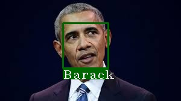

# Face Recognition

It's real-time face recognition using the python library which detects the faces along with the name of that person.

Check out the following python docs for more info: [Click Here](https://pypi.org/project/face-recognition/)

## Demo
<p align="center" width="100%">
  
</p>

## Cloning
Just clone this repository to get the code by using the following command.

```powershell
git clone https://github.com/Yash-Vora/Face-Recognition.git
```

## Installation
Create a Virtual Environment & Install all the following required dependencies.

```powershell
pip install dlib
pip install face_recognition
pip install opencv-python
pip install pickle
pip install argparse
```

**OR**

Just execute the requirements.txt file by running the following command.

```powershell
pip install -r requirements.txt
```

## Train Model With Custom Images
We will use the `face_embedding.py` script to train with custom images.

There are three arguments that you can pass from the cmd/terminal:\
`--class_name - Enter unique class name`\
`--id - Enter unique id`\
`--img_folder_path - Enter image folder path`

**_Examples_**

1. If you want to train the model with custom data.
```powershell
python face_embedding.py --class_name 'Yash' --id 1 --img_folder_path 'train_images/Yash/'
python face_embedding.py --class_name 'Barack' --id 2 --img_folder_path 'train_images/Barack/'
python face_embedding.py --class_name 'Vihan' --id 3 --img_folder_path 'train_images/Vihan/'
```
_Note:_ Pass unique class name & unique id. 

After you run the above script new pickle file will be created with new trained images.

## Face Recognition On Images
We will use the `face_detection_from_image.py` script to recognize faces from images.

### Demo of Face Recognition on Images
<table align='center'>
  <tr>
    <td></td>
    <td></td>
  </tr>
</table>

There are two arguments that you can pass from the cmd/terminal:\
`--img_path - Pass image path`\
`--out_path - Pass output path where output image is stored`

Go to cmd/terminal/powershell and write the following commands to run this script.

1. It will detect the face from the image with the output path.
```powershell
python face_detection_from_image.py --img_path 'test_images/yash_&_vihan.jpeg' --out_path 'Output_Image/yash_&_vihan_output.jpg'
```

2. It will detect face from image without output path:
```powershell
python face_detection_from_image.py --img_path 'test_images/yash.jpeg'
```

## Face Recognition On Web Camera
We will use the `face_detection_from_webcam.py` script to recognize faces from web camera.

### Demo of Face Recognition on Web Camera
<p align="center" width="100%">
  
</p>

There is one argument that you can pass from the cmd/terminal:\
`--out_path - Pass output path where output video will be stored`

Go to cmd/terminal/powershell and write the following commands to run this script.

1. It will detect the face from the web camera with the output path.
```powershell
python face_detection_from_webcam.py --out_path 'Output_Webcam/webcam_output_video.mov'
```

2. It will detect face from web camera without output path:
```powershell
python face_detection_from_webcam.py
```